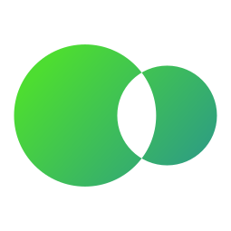

<div style="text-align:center;padding-top:1rem;">
    
    <a href="https://scowez.gitlab.io/owml-website"><h2><b>Owen's Markup Language</b></h2></a>
</div>

## Parser Overview

### About `owml-parser`

This parser for the [`owml` markup language](https://scowez.gitlab.io/owml-website) is a learning project to make a simple library using `nom`. This "core" parser can then easily be extended to runtimes and bindings in other languages (Python using `pyo3` for example) to make a small ecosystem.

*NOTE: As it is a learning project, it may not be to the best of quality.*

### Planned ecosystem

- Core parser library: **[owml-parser](https://gitlab.com/scOwez/owml-parser)**
- `owml` design spec: **[owml spec](https://gitlab.com/scOwez/owml-parser#markup-language-spec-overview)**
- Infomational website: **N/A**
- Python port: **N/A**
- Rust runtime: **N/A**

---

## Markup Language Spec Overview

### About `owml`

`owml` is an easy-to-parse, generalized (can be used in place of json/yaml/toml/similar), implamented with **Rust** + **the `nom` library**.

Some of the key objectives for `owml` are described in the bullet-points below:

- **Easy & efficiant to parse; no infering types.**
- Generalized syntax; cross compatibile with JSON, TOML, YAML or Python Dicts with very small to none changes in layout.
- *Relativly* easy to read; this is not a main priority for this mu language but it is always nice to have.
- ***(Future)*** owml compatibility with serde to allow translations to and from `owml`.

### Example `owml` syntax

```json
(s) "hello there" (o) {
    (s) "woo" (i) 123,
    (i) 3423 (o) {
        (s) "ids" (o) {
            (i) 423 (s) "scOwez",
            (i) 4234 (s) "gdude",
            (i) 234 (s) "bisk",
            (s) "username_dynamic" (s) "woo"
        }
    }
}
```

As you can see, `owml` is a fiercely statically-typed markup language with a different annotation for *every* different type. This has a reason: **parsing ease**.
